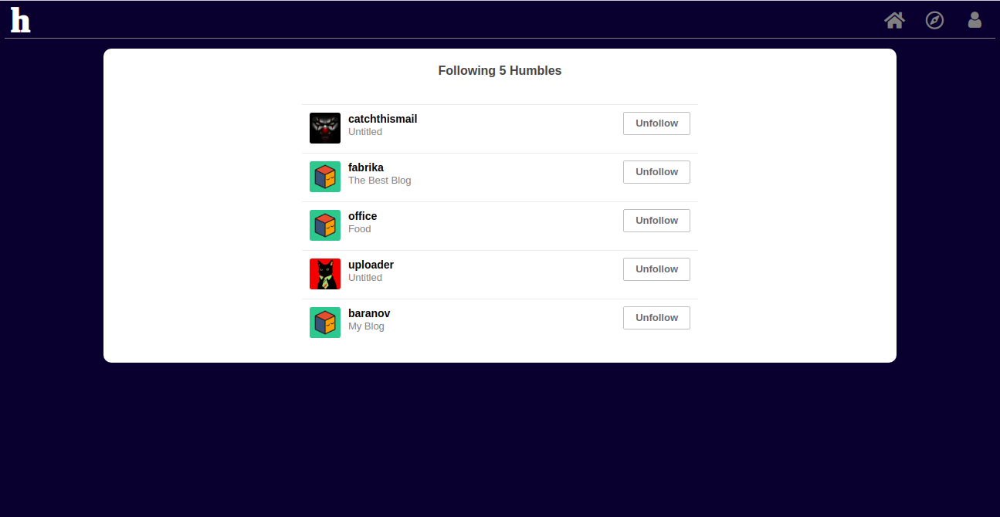
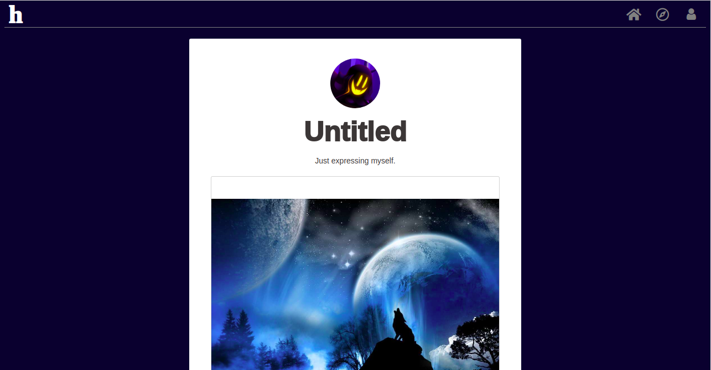

# Humble

Visit Humble live: [Humble](https://humble-app.herokuapp.com/#/)

Humble is a single-page web application inspired by the blogging platform, Tumblr.

## Technologies

### Backend
— RESTful structure

— Associations (Join tables and foreign keys)

— Receives AJAX requests
* Ruby on Rails — Framework
* PostgreSQL — Database
* JBuilder — Generating and rendering JSON objects

### Frontend
— Redux cycle

— React router
  * JavaScript — Primary language
  * React — Re-rendering without page refreshes
  * jQuery — AJAX requests to backend
  * HTML — DOM structure
  * CSS — Styling

### Hosting
  * Docker
  * Heroku Container Registry

## Features

* Sign up, login, or demo the site.

* Create multimedia blog posts.

* Follow and unfollow other blogs.

* Like and unlike blog posts.

* Individual blogs for each user.

* Dashboard containing posts from blogs you follow.

## Future Features

 * Reblog other user's posts to your blog.
 * Comment on blog posts.
 * Search for blogs.