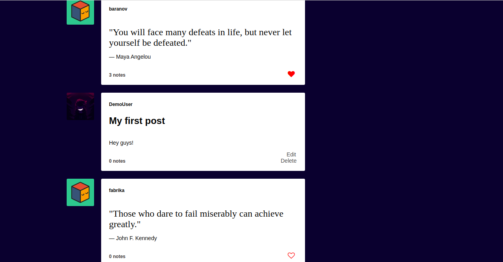

# Humble

Visit Humble live: [Humble](https://humble-app.herokuapp.com/#/)

Humble is a single-page web application inspired by the blogging platform, Tumblr.


## Technologies

### Backend
— RESTful structure

— Associations (Join tables and foreign keys)

— Receives AJAX requests
* Ruby on Rails — Framework
* PostgreSQL — Database
* JBuilder — Generating and rendering JSON objects

### Frontend
— Redux cycle

— React router
  * JavaScript — Primary language
  * React — Re-rendering without page refreshes
  * jQuery — AJAX requests to backend
  * HTML — DOM structure
  * CSS — Styling

### Hosting
  * Docker
  * Heroku Container Registry

## Considerations

Tumblr allows users to post multimedia content to their blogs. As I was building my database tables, I had to stop and think about whether I would create separate tables for different kinds of posts or a singular post table that could hold dynamic information for all posts. I settled on the latter, effectively DRYing up my backend.
```rb
create_table "posts", force: :cascade do |t|
    t.integer "author_id", null: false
    t.string "title"
    t.string "url"
    t.string "caption"
    t.text "summary"
    t.text "description"
    t.string "post_status", null: false
    t.string "post_type", null: false
    t.datetime "publish_date"
    t.datetime "created_at", null: false
    t.datetime "updated_at", null: false
    t.string "image_url"
    t.index ["author_id"], name: "index_posts_on_author_id"
end
```

## Features

* Sign up, login, or demo the site.

* Create multimedia blog posts.

* Follow and unfollow other blogs.
* Like and unlike blog posts.

* Individual blogs for each user.

* Dashboard containing posts from blogs you follow.


## Future Features

 * Reblog other user's posts to your blog.
 * Search for blogs.